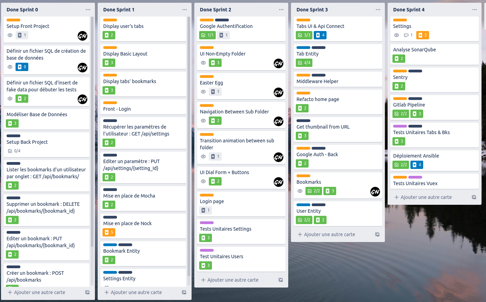
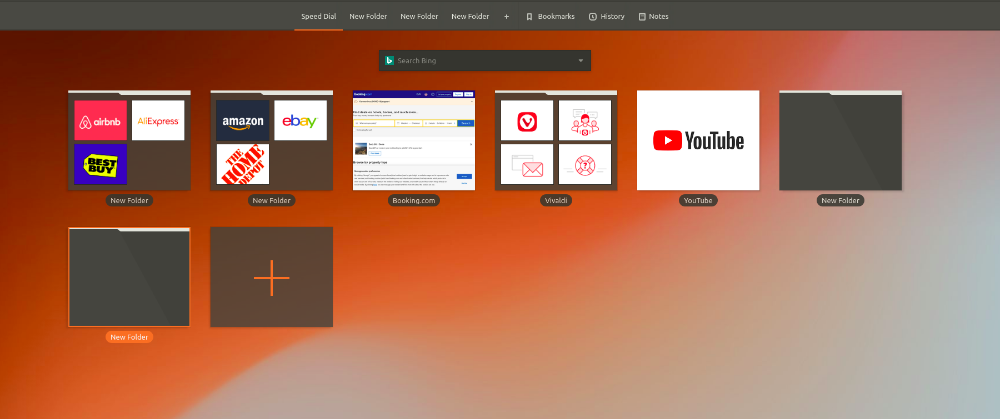
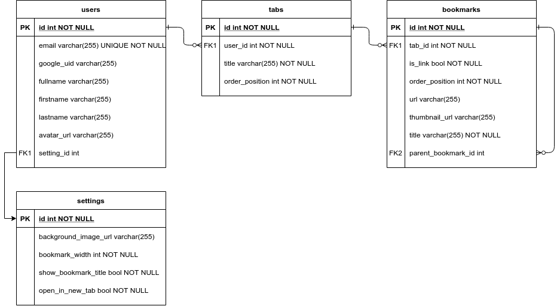
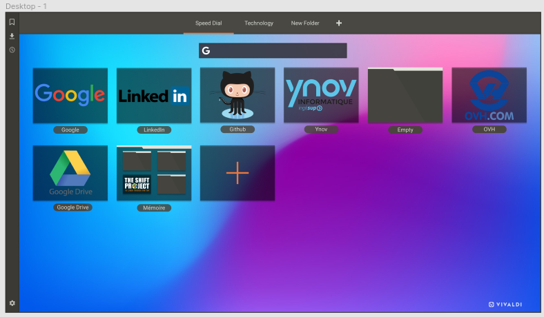

## Préambule

Dans le cadre ce Ydays, j'ai choisi de continuer un projet entamé durant mon année de M1 au sein du cours "Coordination Front-Back".
Lors de cette majeure, nous devions réaliser un projet en groupe et y appliquer les méthodes de travail agile.

C'était à la base un projet perso que j'avais dans l'idée de réaliser mais je me suis dit que c'était pertinent de le proposer à mes 3 autres camarades
dans le cadre de ce cours. Il nous fallait simplement un projet suffisamment conséquent pour y appliquer la méthode SCRUM sur plusieurs semaines
sans forcément avoir besoin de le finaliser.

Nous sommes donc parvenu à l'issue de ce cours avec un projet assez avancé mais pas encore aboutie pour autant.



## Présentation du projet

L'idée de départ du projet est la suivante : j'ai découvert le navigateur Vivaldi te j'ai tout de suite aimé sa page d'accueil, autant sur ses fonctionnalités que sur le style.
La Starter Page de Vivaldi permet de construire une arborescence de dossiers et de liens vers des sites webs, le tout encapsulé dans des onglets.



D'un autre côté, étant utilisateur de Google Chrome, je commençais à atteindre la limite du système de favoris que je ne trouve pas pratique à utiliser dès lors qu'on enregistre des centaines 
de favoris. Je n'avais pas envie de changer de navigateur, et je me suis donc mis dans la tête de réaliser un clone de la page d'accueil de Vivaldi avec des fonctionnalités similaires.

Dawndash est donc un "Starter Page", c’est une simple interface web proposant une mosaïque de boutons cliquables redirigeant vers les sites que l’on veut. 
On peut également créer des dossiers qui pourront contenir eux-mêmes d'autres dossiers ou des liens. 
L'application dispose d’une authentification Google qui aura comme finalité d'être la page d'accueil du navigateur.

Pour plus d'informations, consultez les [Spécifications fonctionnelles et techniques]()

## Objectif du Ydays

Le projet a été commencé l'an dernier mais n'est pas encore utilisable. 
Mes objectifs pour ce Yday sont donc d'amener ce projet à terme et de mettre en oeuvre toutes les bonnes pratiques d'un projet web.

Les tâches à réaliser sont :

- Mise en place d'un environnement de travail sur Docker
- Refonte de la partie back en Laravel
- Refonte des animations
- Achèvement des fonctionnalités inachevées
- Travail sur les performances
- Réécriture et complétion des tests
- Migration des outils d'intégration continue de Gitlab à Github
- Mise en place d'un déploiement continue

L'objectif final est d'avoir une V1 de l'application en production.

---

Ce blog va servir de support de présentation pour le projet, en présentant à travers les articles les 
différentes technologies et outils que j'ai mis en place pour réaliser ce projet.


---

## 1. Concept

### 1.1. Résumé
Dawndash est un ‘Speed Dial’, c’est une simple interface web proposant une mosaïque de boutons cliquables redirigeant vers les sites que l’on veut. On peut également créer des dossiers qui pourront contenir eux-mêmes d'autres dossiers ou des liens . L'application est un Saas qui dispose d’une authentification via Google qui aura comme finalité d'être la page d'acccueil du navigateur.

### 1.2. Objectif
Dawndash a pour but de combler un manque sur les extensions de Speed Dial classiques qui sont un peu limités et au design assez dépassé. A contrario, le navigateur Vivaldi propose par défaut comme Start Page un Speed Dial au design épuré et aux fonctionnalités plus poussées. L’objectif de Dashdawn est donc de se rapprocher le plus possible de l’interface de Vivaldi en permettant d’utiliser une interface similaire sur d'autres navigateurs.

## 2. Spécifications fonctionnelles

### 2.1. Fonctionnalités

- L’utilisateur arrive par défaut sur une page de connexion avec l’authentification Google. (Il ne peut pas aller plus loin s’il ne s’est pas authentifié).

- L'utilisateur peut :
    - Créer un onglet
    - Renommer un onglet
    - Supprimer un onglet
    
    - Créer un bookmark 'Link'
    - Renommer un bookmark 'Link'
    - Sélectionner un custom thumbnail pour un bookmark 'Link'

    - Créer un bookmark 'Folder'
    - Renommer un bookmark 'Folder'
    - Modifier un bookmark 'Folder' (Changer son nom et son arborescence)

    - Changer l'ordre des Bookmarks
    - Supprimer un Bookmark

    - Faire une recherche Internet (sur Google au début par défaut)
    - Importer le ficher .json des favoris que Google Chrome permet d'exporter pour recrér l'arborescence des favoris dans l'application
    - Editer ses préférences pour changer par exemple :
        - Le nombre de colonne max
        - Changer son image de fond
        - Changer la taille des tuiles
        - Show/Hide Bookmarks Title


### 2.2. Idées de Fonctionnalités Bonus 

- Lors de la phase de création d'un bookmark, on peut ajouter la possibilité de proposer à l'utilisateur une sélection de sites à ajouter en fonction des sites qu'il a déjà ajouté (sites similaires grâce à : https://www.alexa.com/find-similar-sites)
- Proposer à l'utilisateur de configurer une connexion à son Trello ou Todoist pour lui mettre des rappels sur ses tâches à faire
- Lui afficher la météo de sa région
- Afficher les tendances Twitter
- Faire un semblant de Knowledge Base à la Confluence
- Avoir un formulaire qui accepte l'URL d'une vidéo youtube, et qui permet la télécharger en mp3 ou mp4

## 3. Spécifications techniques

### 3.1 Choix technologiques

Back : API en Laravel

Front : SPA en Nuxt + VueJS

### 3.2 Schéma de la base de données




### 3.3 Maquette Figma




### 3.4 API Endpoints

```
+----------------------------+----------+-------------------------------+
| Action                     | Method   | URI                           |
+----------------------------+----------+-------------------------------+
| Create one Bookmark        | POST     | api/bookmarks                 |
| Update severals Bookmarks  | PATCH    | api/bookmarks/bulk            |
| Update one Bookmark        | PUT      | api/bookmarks/{bookmark}      |
| Delete one Bookmark        | DELETE   | api/bookmarks/{bookmark}      |
| Get or Create User         | GET|HEAD | api/me                        |
| Update Settings            | PUT      | api/settings/{setting}        |
| Update one Tab             | PUT      | api/tabs/{tab}                |
| Delete one Tab             | DELETE   | api/tabs/{tab}                |
| Get all Users              | GET|HEAD | api/users                     |
| Get all Tabs by User       | GET|HEAD | api/users/{user}/tabs         |
| Create one Tab             | POST     | api/users/{user}/tabs         |
+----------------------------+----------+-------------------------------+
```

