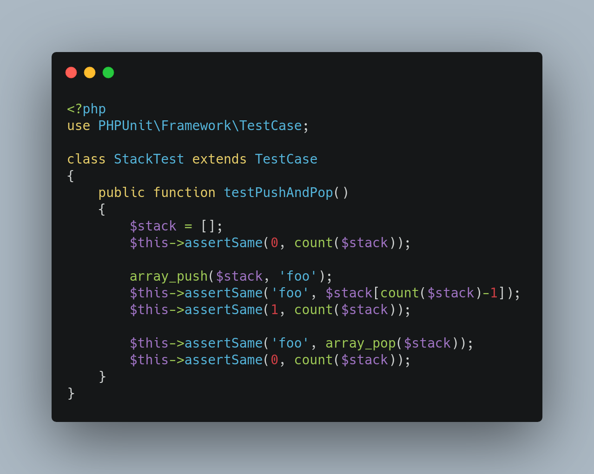
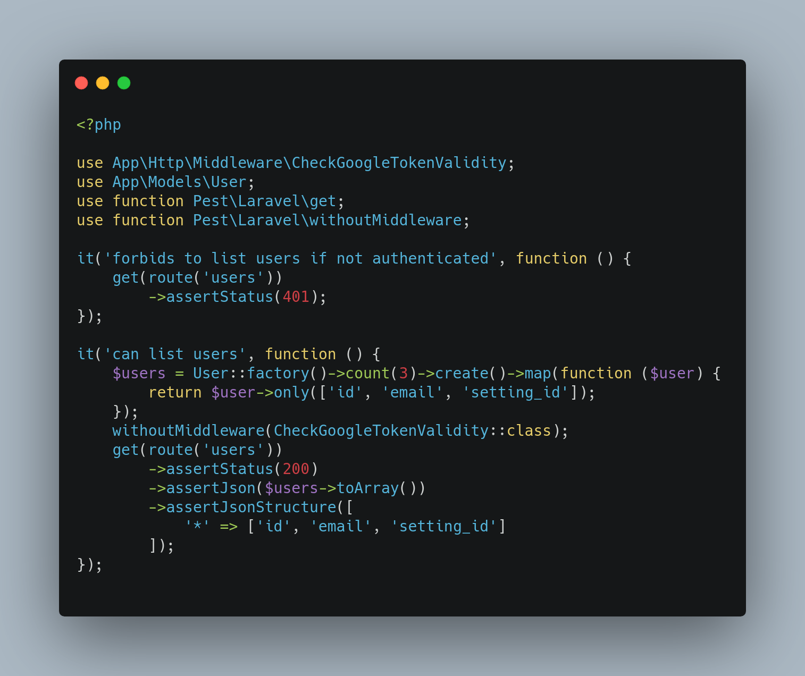

## Mise en contexte

PHPUnit est LE framework de référence pour écrire des tests avec PHP. 
Avec pas moins de 17 000 stars sur [github](https://github.com/sebastianbergmann/phpunit) et plus de 14 000 commits, sa réputation n'est plus 
à faire et fait maintenant partie des hardskills communs à tous les 
développeurs PHP (s'ils réalisent des tests bien sûr). C'est également la librairie de tests par
défaut des frameworks les plus populaires : Symfony et Laravel. 

C'est justement de la communauté de cette dernière qu'émergent énormément de projets novateurs
qui essaient de rafraichir régulièrement l'environnement PHP. Laravel est en effet un framework
qui essaie au maximum de rendre l'expérience pour le développeur la plus confortable possible. 
C'est ainsi que de nombreux projets ont vu le jour ces dernières années dans l'environnement
Laravel visant à donner des outils clés en mains aux développeurs pour ne pas réinventer la 
roue à chaque fois. Parmi ces projets, on peut citer [Livewire](https://laravel-livewire.com/) 
pour profiter des avantages d'un framework JS sans quitter l'environnement Laravel, [Jetstream](https://jetstream.laravel.com/)
qui offre toutes les implémentations basiques qu'un dev peut avoir besoin, ou encore [Collision](https://github.com/nunomaduro/collision) 
un outil d'affichage d'erreur qui ne peut être plus clair.

Ce dernier outil a justement été développé par [Nuno Maduro](https://nunomaduro.com/), un développeur 
très actif dans la communauté Laravel qui a d'ailleurs rejoint l'équipe de Laravel en 2020. C'est aussi 
dans cette année passée qu'il a développé [Pest](https://pestphp.com/), nommé et inspiré du framework de 
test Javascript [Jest](https://jestjs.io/).

## Pourquoi Pest ?

Pest a pour objectif d'être une alternative plus confortable et minimale à PHPUnit.
En effet PHPUnit est lourd dans le sens où, pour commencer à écrire des tests, il faut d'abord créer une
classe, puis créer une fonction par test que l'on veut.

Quant à Pest, il se concentre sur deux aspects : 

- La légèreté avec une syntaxe très épurée :

- La lisibilité avec un rapport dans la console plus clair que PHPUnit :

## Conclusion

Pest n'est pas forcément un must have indispensable, mais il apporte un vent de fraicheur dans 
l'écriture de tests qui peut s'avérer fastidieux. C'est un petit plus qui peut motiver à écrire 
ses tests. Je l'ai personnellement utilisé pour mon projet Dawndash et j'en suis très satisfait.

