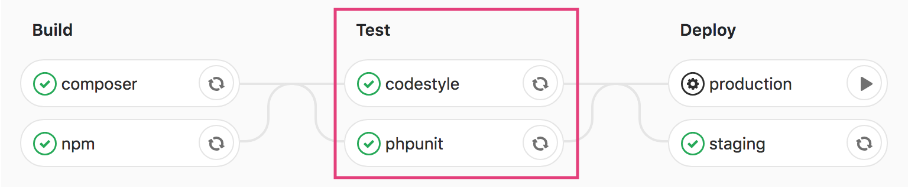

Dans mon article précédent, j'ai expliqué les bases des images Docker et présenté une
pipeline GitLab simple qui exécute notre suite de tests et vérifie le style de notre code.

Dans cet article, nous allons mettre en place un pipeline plus complexe 
qui finit par déployer notre application en utilisant Laravel Deployer.

## Définition d'une Pipeline

Avant de plonger dans le code, prenons une minute pour décider à quoi doit ressembler notre pipeline final.

Tout d'abord, j'aimerais que le pipeline construise nos dépendances et nos ressources.
Ensuite, j'aimerais m'assurer qu'aucun test n'a été cassé, ni aucun style de code violé.
Enfin, j'aimerais utiliser mon application précédemment construite pour la déployer sur mes environnements de staging et de production.

Nous pouvons classer ces trois points en trois catégories : Build, Test et Deploy, qui constituent la définition de l'étape par défaut de GitLab.

```yaml
stages:
  - build
  - test
  - deploy
```

Voici le pipeline final que nous aurons à la fin de cet article. 


- **Build**. Nous construirons les dépendances de composer dans une tâche et c
  ompilerons nos ressources dans une autre afin de les exécuter en parallèle e
  t d'améliorer les performances de notre pipeline.
  
- **Test**. Nous allons ensuite exécuter notre suite de tests et vérifier notre style de code, 
  également en parallèle.
  
- **Deploy**. Enfin, nous allons déployer automatiquement sur notre serveur de staging et 
  attendre une confirmation manuelle avant de déployer sur notre serveur de production. 
  De cette façon, nous, les humains, pouvons revoir nos changements sur l'environnement 
  de staging et jouer le déploiement de production si et seulement si nous sommes satisfaits 
  des résultats. 


## Cache 

Le premier mécanisme fourni par GitLab est la mise en cache.
Il est très similaire à la mise en cache dans Laravel, 
vous décrivez ce que vous voulez mettre en cache et fournissez une clé pour 
récupérer le contenu potentiellement mis en cache plus tard.

Ceci est surtout utile lorsque l'on utilise la branche comme clé, 
par exemple `master`. De cette façon, nous pouvons partager le contenu 
entre tous les pipelines d'une même branche et améliorer les performances de nos pipelines.


## Artifacts

Le deuxième mécanisme fourni par GitLab consiste à générer des artifacts. 
Vous pouvez considérer les artifacts comme le résultat d'une tâche qui sera 
automatiquement fourni aux tâches suivantes. Ce résultat est simplement 
un ensemble de fichiers et de dossiers prédéfinis qui est compressé à la fin d'une tâche.

Disons que j'ai trois tâches : build, test et deploy qui sont respectivement 
dans les stages build, test et deploy. Si je définis certains artifacts dans 
la tâche de `build`, les tâches `test` et `deploy` les 
téléchargeront automatiquement avant de démarrer.


## Le fichier gitlab-ci

Reprenons le fichier `.gitlab-ci.yml` là où nous l'avions laissé au dernier article.

```yaml
image: lorisleiva/laravel-docker:stable

.before_test_script_template:
  services:
    - mysql:latest
  variables:
    MYSQL_ROOT_PASSWORD: secret
    MYSQL_DATABASE: dawndash_api
    MYSQL_USER: homestead
    MYSQL_PASSWORD: secret

codestyle:
  stage: test
  script:
    - vendor/bin/phpcs --ignore=config/deploy.php

phpunit:
  stage: test
  extends: .before_test_script_template
  cache:
    key: ${CI_COMMIT_REF_SLUG}-composer
    paths:
      - vendor/
  script:
    - composer install --prefer-dist --no-ansi --no-interaction --no-progress --no-scripts
    - cp .env.example.docker .env
    - php artisan key:generate
    - php artisan migrate:refresh
    - php artisan db:seed
    - php artisan test
```

## L'étape de Build


### Composer

Le but de cette tâche est d'initialiser correctement notre application Laravel en exécutant 
`composer install` et en s'assurant que notre fichier `.env` est valide.

```yaml
composer:
  stage: build
  script:
      - composer install --prefer-dist --no-ansi --no-interaction --no-progress --no-scripts
      - cp .env.example .env
      - php artisan key:generate
```
C'est assez simple. Maintenant, nous voulons "output" 
le dossier `vendor` et le fichier `.env` en utilisant des artifacts 
afin que les tâches des étapes suivantes puissent automatiquement en hériter.

```yaml
composer:
  # ...
  artifacts:
    expire_in: 1 month
    paths:
      - vendor/
      - .env
```

Enfin, nous voulons mettre en cache le dossier du fournisseur pour nous assurer que le travail de
`composer` de notre prochaine pipeline ne le créera pas à nouveau à partir de zéro.

```yaml
composer:
  # ...
  cache:
    key: ${CI_COMMIT_REF_SLUG}-composer    
    paths:
      - vendor/
```

### Npm

De manière très similaire au travail de `composer`, nous définissons une tâche `npm` responsable 
de l'installation de nos dépendances node et de la compilation de nos assets.

```yaml
npm:
  stage: build
  cache:
    key: ${CI_COMMIT_REF_SLUG}-npm
    paths:
      - node_modules/
  script:
    - npm install
    - npm run production
  artifacts:
    expire_in: 1 month
    paths:
      - node_modules/
      - public/css/
      - public/js/
```

## L'étape de Test



### Phpunit

La tâche `phpunit` hérite automatiquement de tous les
artifacts des tâches `composer` et `npm`. 
Par conséquent, les dépendances de notre composer et notre fichier .env sont prêts à être utilisés.
Tout ce qu'il reste à faire est de lancer phpunit.

```yaml
phpunit:
  stage: test
  script:
    - php artisan test
```

C'est simple et agréable. 
Cependant, les artifacts `npm` ne sont pas nécessaires au bon 
fonctionnement de phpunit. 
Nous pouvons éviter de télécharger des artifacts inutiles en 
indiquant explicitement à la tâche ce qu'elle doit utiliser :

```yaml
phpunit:
  stage: test
  dependencies:
    - composer
  script:
    - php artisan test
```

### Codestyle

Comme pour la tâche `phpunit`, on précise ici que nous avons seulement
besoin de la tâche `composer` comme dépendance.

```yaml
codestyle:
  stage: test
  dependencies:
    - composer
  script:
    - vendor/bin/phpcs --ignore=config/deploy.php
```

## L'étape Deploy


### Initialiser la connexion SSH

Vous vous demandez peut-être comment nous allons faire pour que nos pipelines GitLab communiquent avec notre serveur ?

Dans un environnement habituel, nous générerions une nouvelle paire de clés SSH et donnerions la clé publique au serveur.
Cependant, si nous générons une nouvelle clé SSH pour chaque pipeline, nous allons devoir mettre à jour les clés de 
confiance du serveur à chaque fois que nous exécutons un pipeline. Ce n'est donc évidemment pas une option.

L'idée est beaucoup plus simple.

1. Nous créons une nouvelle paire de clés SSH localement sur notre machine.
2. Nous donnons la clé publique à notre serveur.
3. Nous donnons la clé privée à GitLab en utilisant des variables secrètes.
4. Nous utilisons cette clé privée dans nos pipelines.

Pour donner cette clé à Gitlab, il faut aller dans les paramètres du projet : 
`Settings > CI/CD > Variables`


Nous pouvons maintenant lancer un agent ssh 
et lui demander d'utiliser la variable $SSH_PRIVATE_KEY 
que nous avons ajoutée au point précédent. 
GitLab nous fournit un petit script qui fait exactement cela.

```yaml
.init_ssh: &init_ssh |
  eval $(ssh-agent -s)
  echo "$SSH_PRIVATE_KEY" | tr -d '\r' | ssh-add - > /dev/null
  mkdir -p ~/.ssh
  chmod 700 ~/.ssh
  [[ -f /.dockerenv ]] && echo -e "Host *\n\tStrictHostKeyChecking no\n\n" > ~/.ssh/config
  
staging:
  # ...
  script:
    - *init_ssh
    - Deploy to the staging host using Laravel Deployer
```

### Mettre en place Laravel Deployer

Afin de déployer notre application Laravel, nous allons utiliser Laravel Deployer. 
Il s'agit d'un package Laravel qui donne à `php artisan` la puissance d'un déploiement rapide.

Nous définissons dans les fichiers de configuration nos différents environnements
et les emplacemnts dans lesquelles le projet sera installé

```php
    # config/deploy.php

    'hosts' => [
        'dawndash.ovh' => [
            'deploy_path' => '/home/guillaumeh/dawndash-api',
            'user' => 'guillaumeh',
        ],
        'staging.dawndash.ovh' => [
            'deploy_path' => '/home/guillaumeh/staging_dawndash-api',
            'user' => 'guillaumeh',
        ],
    ],
```

### Utiliser Laravel Deployer dans notre pipeline

Maintenant que nous avons installé Laravel Deployer et établi une communication SSH 
entre GitLab et notre serveur, nous pouvons appeler `php artisan deploy`
directement dans nos pipelines.

Si nous avons plusieurs hôtes définis dans notre config/deploy.php, 
l'exécution de `php artisan deploy` déploiera sur tous ces hôtes. 
Par conséquent, dans chaque tâche de déploiement, nous devons spécifier 
sur quel hôte nous souhaitons effectuer le déploiement. 
Par exemple, l'exécution de `php artisan deploy dev.yourdomain.com`
n'effectuera le déploiement que sur notre serveur de développement.

De plus, par défaut, Laravel Deployer utilise la stratégie de base pour
le déploiement sur votre serveur. La stratégie de base créera une nouvelle 
version sur votre serveur, construira tout par-dessus et, lorsqu'elle sera prête,
l'attachera au lien symbolique actuel pour la rendre opérationnelle.

#### Déploiement automatique de Staging

```yaml
stating:
  stage: deploy
  script:
    - *init_ssh
    - cp .env.example .env
    - php artisan key:generate
    - php artisan env:set db_password ${MYSQL_PASSWORD}
    - php artisan deploy staging.dawndash.ovh -s upload
  environment:
    name: stating
    url: https://staging.dawndash.ovh
  only:
    - master
```

### Déploiement manuel de Production

```yaml
deploy:
  stage: deploy
  script:
    - *init_ssh
    - cp .env.example .env
    - php artisan key:generate
    - php artisan env:set db_password ${MYSQL_PASSWORD}
    - php artisan deploy dawndash.ovh -s upload
  environment:
    name: production
    url: https://dawndash.ovh
  when: manual
  only:
    - master
```

## Conclusion

Cette étape de déploiement continu est un peu fastidieuse à mettre en place au début
mais maintenant que c'est fait on va pourra gagner énormément de temps par la suite.