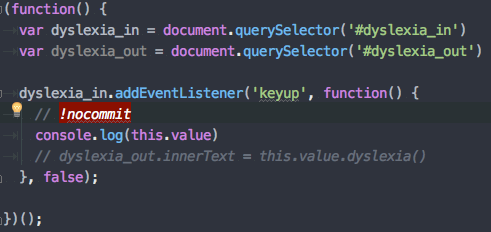

## Qu'est-ce que les git hooks ?

Les git hooks sont un moyen de lancer des scripts automatiquement à chaque fois 
qu'un évènement a lieu dans un repo git. Cela permet de déclencher des
actions personnalisées à un certain moment du cycle de vie du projet.
Les git hooks sont souvent utilisés pour s'assurer que le code 
écrit par chaque développeur respecte un certain niveau de qualité au sein du projet.

Les scripts des git hooks sont situés dans le dossier `.git/hooks` de chaque repository git.
Git nous donne automatiquement un ensemble de scripts d'example à l'initialisation du
repository. Chaque script correspond à un évènement. Ceux-ci seront automatiquement
exécutés lorsque l'évènement qui leur est associé est déclenché.

Ce script va généralement tester si une ou plusieurs conditions sont vérifiées.
Si ces conditions ne sont pas vérifiées, le script devra terminer avec le code d'éxecution '1'.
C'est le comportement général lorsqu'un script se termine en erreur. Si les conditions sont 
vérifiées, alors il se terminera avec le code d'éxecution '0'.

## Example : Hook de pre-commit

L'un des évènements les plus couramment utilisés parmi les git hooks est 
l'utilisation du hook de pre-commit. Cet évènement se déclenche dès qu'un commit est réalisé.
Dans ce script de pre-commit, on va souvent vouloir vérifier la qualité du code avec un 
linter.

Un exemple de comportement personnalisé pourrait être le suivant :  
Lorsque l'on écrit du code dans le but de débug, on ne veut pas commit ce code. Dans
ce cas-là, on va écrire le commentaire `// !nocommit` juste avant la ligne que l'on ne veut pas 
commit pour l'identifier.

Puis, dans le script `.git/hooks/pre-commit`, nous allons tester si l'on détecte le commentaire
la chaîne `!nocommit` dans les modifications apportées, alors le commit est annulé.

## Husky & solutions alternatives

[Husky](https://github.com/typicode/husky) est une librairie JS permettant de simplifier la création 
de hook. Après avoir installé et configuré le package comme indiqué dans la documentation, on peut 
simplement créer un hook, de pre-commit par exemple, comme suit :

`npx husky add .husky/pre-commit "npm run lint"`

Cela aura pour effet de nous créer le fichier suivant :

Et c'est tout ! Rien de plus à faire pour que la commande `npm run lint` s'éxecute au prochain commit.

De la même manière, il existe aussi des librairies similaires qui fonctionnent avec PHP, notamment 
[Composer Git Hooks](https://github.com/BrainMaestro/composer-git-hooks).

Dans ce cas-là, il suffit simplement d'indiquer les commande à éxecuter dans le fichier composer.json :

De ce fait, on peut facilement garder un repository distant propre grâce à ces quelques outils très simples à mettre en place.