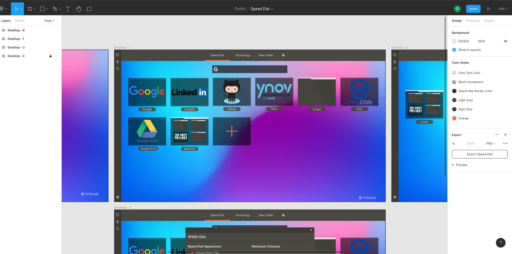
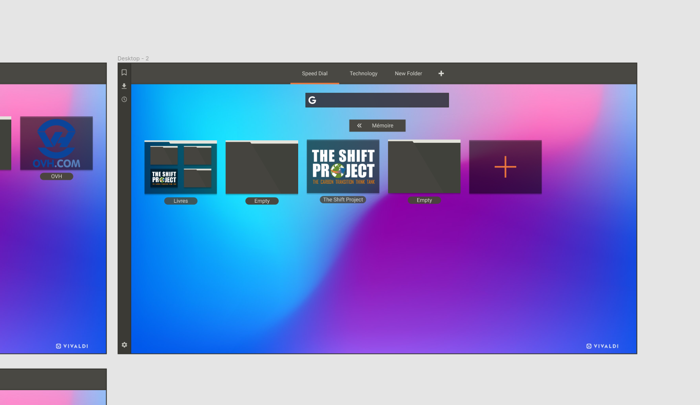

Dans le cadre de ce projet, j'ai voulu découvrir et utiliser [Figma](https://www.figma.com/). 
Un outil de maquettage et de prototypage présenté sous forme d'une application web
extrêmement performante et simple d'utilisation.

Je vais donc présenter rapidement dans cet article les fonctionnalités et points forts de Figma.

## Un outil pour designer des interfaces

Figma est un outil de création d’interfaces qui se différencie de Sketch ou encore d’Adobe XD par plusieurs aspects.

- Sa simplicité, fortement inspirée de Sketch pour une meilleure appréhension par les designers,
- Ses fonctionnalités (commentaires, versioning, partage…)
- Sa grande communauté (aspect collaboratif),
- Les librairies de composants directement intégrées à chaque projet,
- Son coût en fait un outil incontournable et possède une limite gratuite de 3 projets max

## Points forts

**Le versioning** : une seule et unique version de fichier qui permet d’éviter des erreurs d’interprétation des maquettes. Ainsi, pas de fichier source perdu ou démultiplié par le nombre d’intervenants. Bien-sûr, il est possible d’enregistrer ses fichiers sources pour réaliser des back-ups.

**Les librairies de composants** : lors de la création d’une interface, il est possible de créer une librairie de composants basée sur le principe de l’atomic design et ainsi la partager à n’importe quel membre de votre équipe. C’est une fonctionnalité assez puissante.
Elle s’avère être encore plus puissante lors de la réalisation d’un design system qui permettra à chaque nouveau projet d’être réalisé sur une base de composants validés. Ce système augmentera la productivité du projet tout en respectant les guidelines mises en place.

**Collaboratif** :

- Le partage des maquettes au travers d’un simple lien de visualisation.
Très pratique pour partager auprès d’un client ou lors d’une présentation/démo de prototype.

- Les exports CSS pour les dévs : Figma permet au développeurs d’inspecter les éléments de chaque maquettes et d’exporter le CSS ainsi que le code iOS / Androïd.

## Retour d'expérience

J'ai beaucoup aimé utiliser Figma. Je ne connais pas du tout les logiciels de maquettage habituel
ou encore les logiciels de retouche d'images, mais ce qui m'a marqué est sa simplicité 
d'utilisation même pour quelqu'un qui ne vient pas du milieu du design UI/UX.

Je me suis aidé d'une [vidéo de Grafikart](https://www.youtube.com/watch?v=e68PKFYWfoQ) pour rapidement prendre en main les quelques notions
principales, ce qui m'a permis de me lancer dans le maquettage sans aucune appréhension.

